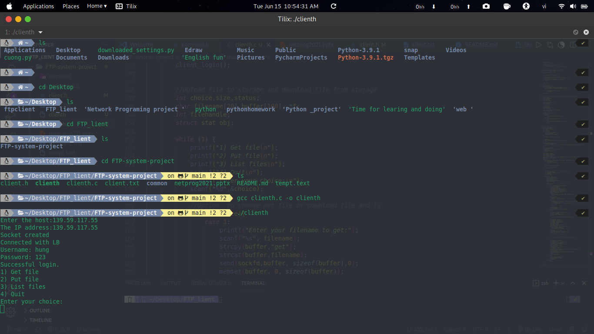
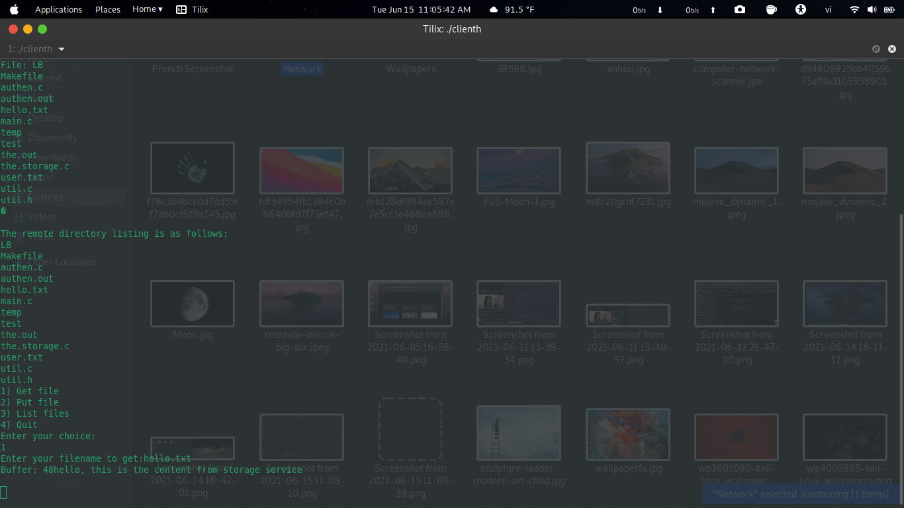
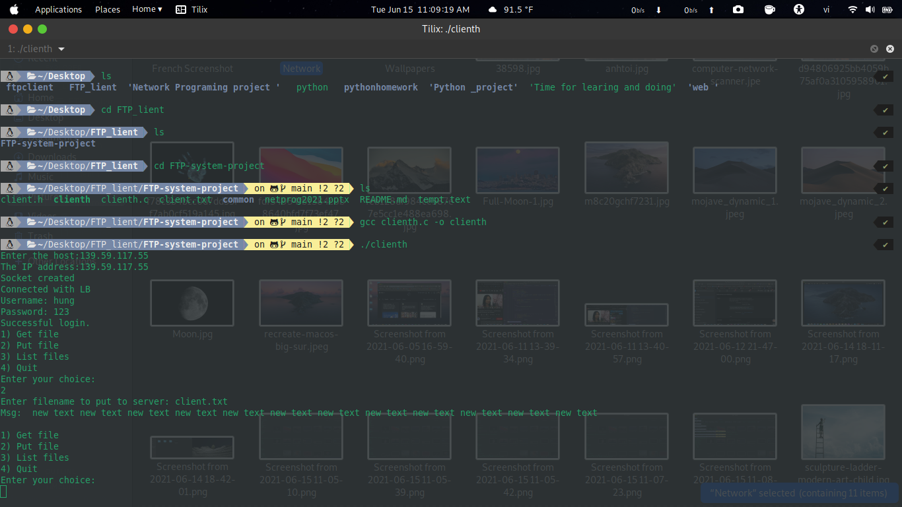
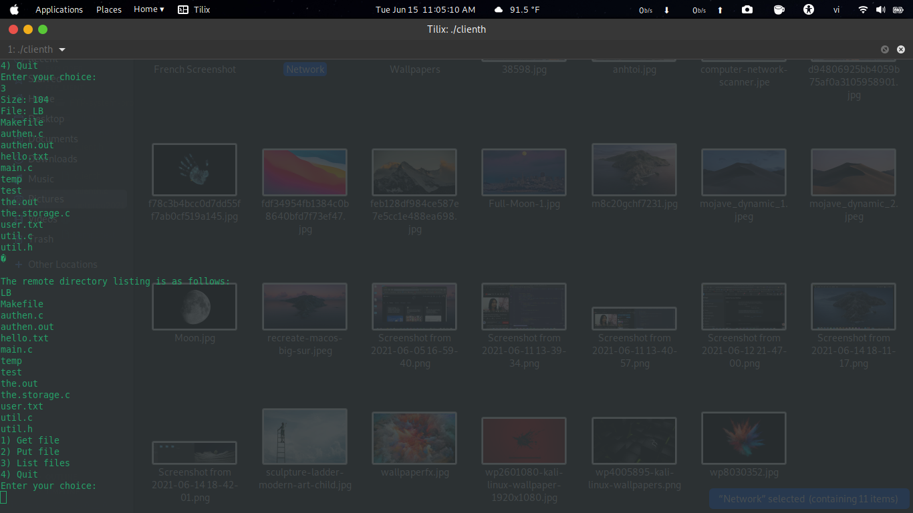
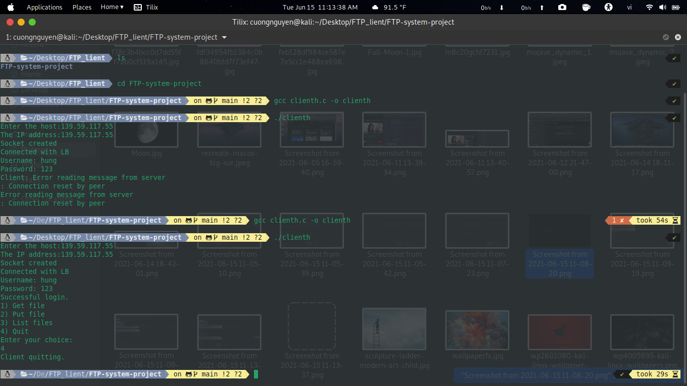

<div align="center">

Network Programing

# **Report Project: CLIENT**
<br/>
**Group: 4**

**University of Science and Technology of Hanoi**

June 2021

<br/>

## **Group members**

```
Nguyễn Ngọc Khiêm

Nguyễn Văn Cường

Đặng Hoàng Phúc
``` 
</div>
<br/>

## **TABLE OF CONTENTS**

- [I/ Introduction](#intro)
    + [1. Overview](#intro1)
    + [2. Why we need Client?](#intro2)
    + [3. Preparations](#intro3)
- [II/ Implementation](#implementation)
    + [1. Online storage system](#implementation1)
    + [2. Planning](#implementation2)
    + [3. Protocol](#implementation3)
    + [4. Socket methods ](#implementation4)
    + [5. Client UI](#implementation5)
- [III/ Conclusion](#conclusion)

## I/ Introduction <a name="intro"></a>

### 1. Overview <a name="intro1"></a>

&ensp;&ensp;&ensp;A client is a computer or a program that, as part of its operation, relies on sending a request to another program or a computer hardware or software that accesses a service made available by a server (which may or may not be located on another computer).

&ensp;&ensp;&ensp;A client is part of a client–server model, which is still used today. Clients and servers may be computer programs run on the same machine and connect via inter-process communication techniques. Combined with Internet sockets, programs may connect to a service operating on a possibly remote system through the Internet protocol suite. Servers wait for potential clients to initiate connections that they may accept.


### 2. Why we need Client? <a name="intro2"></a>

&ensp;&ensp;&ensp;A client provides an environment in which you can upload files to a server, download files from a server to your device, and view and manage files stored on your web server.

&ensp;&ensp;&ensp;Many clients allow you to do other things too, like connect to cloud storage platforms (i.e Dropbox and Google Drive), download files from server and upload files to storage server.

### 3. Preparations <a name="intro3"></a>

 Software and Tools

- OS: Windows 10
- Environment: Python 3.9
- Database: Mysql
- Storage: Github
- IDE: Pycharm, Visual Studio Code
- Software: Mysql Workbench, Mysql Server

## II/ Implementation <a name="implementation"></a>

### 1. Online storage system <a name="implementation1"></a>

&ensp;&ensp;&ensp;**Firstly, I will talk about how the Online Storage System works.**
<div align="center">

</div>

```
The system working as follows:

Step 1: Client connect to Load Balancer.

Step 2: Load Balancer connect to Auth Server.

Step 3: Client enter username and password to Load Balancer.

Step 4: LB forward Client's login information to Auth Server.

Step 5: Authentication Server verify client's login information validity or not.

Step 6: Then response Y/N to Load Balancer.

Step 7: LB forward Y/N response of Authentication SV to client.

Step 8: Client send request for upload/download files to Load Balancer.

Step 9: Load Balancer forward the client's request to Storage.

Step 10: Storage receive client request and show the content of storage through Load Balancer and forward to client.
```

### 2. Planning <a name="implementation2"></a>

&ensp;&ensp;&ensp;**Secondly,  the steps the client takes to connect to the server:**
```
- Enter hostname and IP for the load balancer
- Enter username/password
- Connect to load balancer on 8000 ports.
- Sent username/password on the connected port and connected socket.
- Wait for Yes or No from load balancer.
- When the answer is Yes:
	+ Let user to upload and download files
	+ Send message to load balancer get file content and upload file.
	+ Using same connection.
- When the answer is No:
	+ Error message.
```

### 3. Protocol <a name="implementation3"></a>
&ensp;&ensp;&ensp;**Thirdly, to connect to Load Balancer and perform processes in the system, we cannot but talking  the port which helps Client connect to Load Balancer.**

- The protocol used in the report client is TCP Port 8000.<br/>
- TCP Port 8000 may use a defined protocol to communicate depending on the application. A protocol is a set of formalized rules that explains how data is communicated over a network. Think of it as the language spoken between computers to help them communicate more efficiently.

**PORT 8000 – Information**
```
+ Port Number: 8000
+ TCP / UDP: TCP
+ Delivery: Yes
+ Protocol / Name: irdmi
+ Port Description: iRDMI
+ Virus / Trojan: No
+ Use our free Digital Footprint and Firewall Test to help verify you are not infected.
```
  <br/>
  
- TCP port 8000 uses the Transmission Control Protocol. TCP is one of the main protocols in TCP/IP networks. Whereas the IP protocol deals only with packets, TCP enables two hosts to establish a connection and exchange streams of data. TCP guarantees delivery of data and also guarantees that packets will be delivered on port 8000 in the same order in which they were sent. Guaranteed communication over port 8000 is the key difference between TCP and UDP. UDP port 8000 would not have guaranteed communication in the same way as TCP.

### 4. Socket methods <a name="implementation4"></a>
&ensp;&ensp;&ensp;**Next, Moving on socket methods.**
- In this report, we use blocking socket. 
- Using blocking sockets means that only one socket may be active at any time in any one thread (because it blocks while waiting for activity).
- Using blocking sockets is generally easier than non-blocking sockets (asynchronous programming tends to be more complicated).


### 5. Client UI <a name="implementation5"></a>
&ensp;&ensp;&ensp;**Last but not least, it helps us to see more clearly about the client's interface in this system.**

&ensp;&ensp;&ensp; Connect load balancer on 8000 ports


&ensp;&ensp;&ensp; Enter host name form load balancer: 139.59.117.55


&ensp;&ensp;&ensp; Enter username and password: hung, 123 (The client sends username/password to LB. LB forwards this login info to the authentication server. Authentication server verifies the user, responses yes/no for the login. LB forwards this yes/no response to the client.)


&ensp;&ensp;&ensp; The interface of the system appears 4 options for the user



- First choose: get file which means download allows the user to download a file from storage.


- Second choose: Put file - Upload allows the user to upload a file to storage. 



- Thỉrd choose: List file - If the user wants to upload files to storage, this option will have the task of displaying the files that the user wants to upload. Otherwise, If the user wants to download files from storage, this option will have the task of displaying the files that the user wants to download.





- Last choose: quit - The system will confirm finish the work and disconnects from the host.




## III/ Conclusions <a name="conclusion"></a>

&ensp;&ensp;&ensp;We have created a client that helps users provide an environment to upload files, download files from the server to the client's device.

&ensp;&ensp;&ensp;Working on a real project together with teammates, we learned a lot of valuable things like partnership, planning and task division. We studied extensively during and be aware of the implementation process's requirements.
