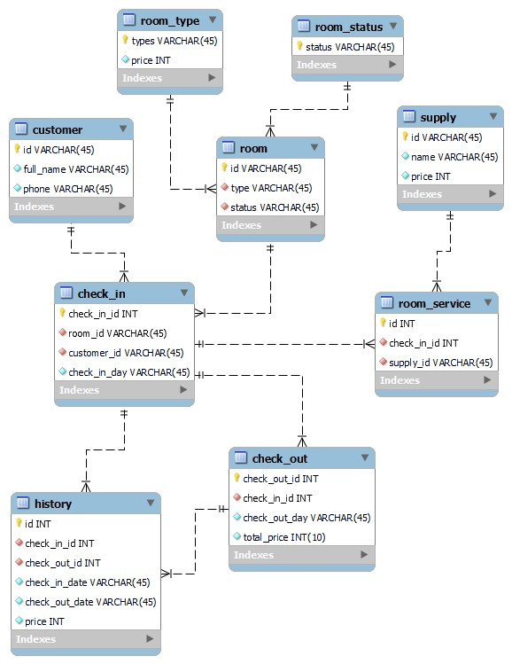
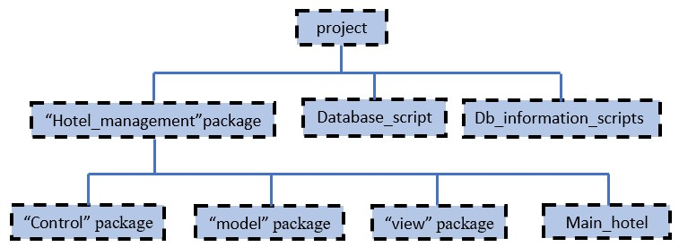
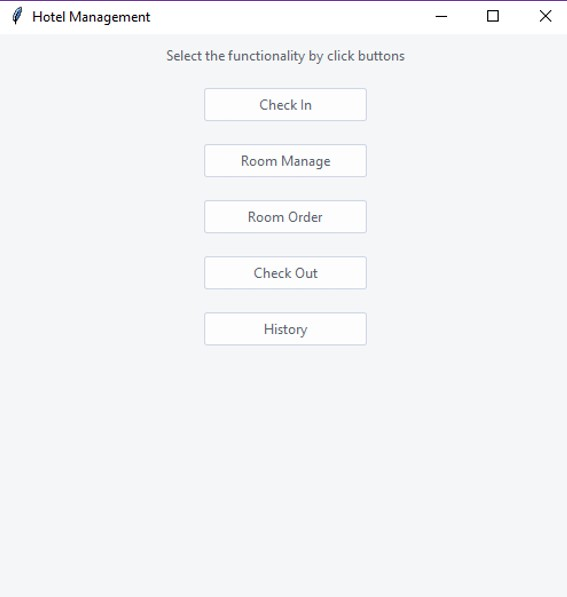
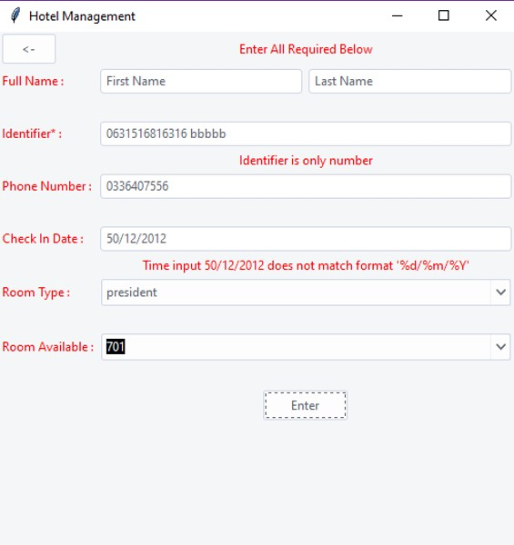
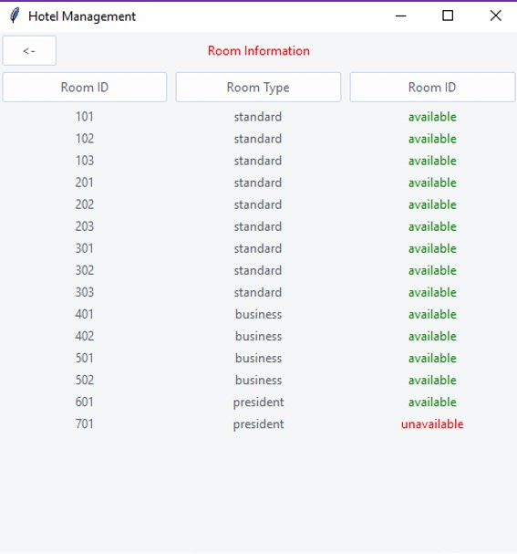
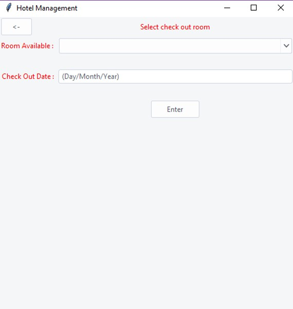
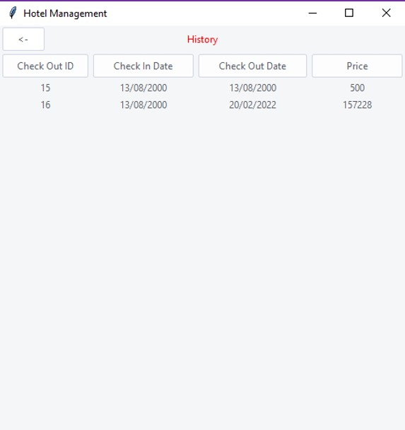

<div align="center"
 
Advanced Programming with Python

# **Report Project: HOTEL MANAGEMENT SYSTEM**
     
&nbsp;
     
**Group: 8**

**University of Science and Technology of Hanoi**

May,2021

&nbsp;
&nbsp;
     
## **Group members**

Lê Anh Tú

Đỗ Mạnh Thắng

Nguyễn Ngọc Khiêm

Nguyễn Văn Cường

Đặng Hoàng Phúc
 
 </div>

## **TABLE OF CONTENT:**

- [I/ Introduction](#intro)
- [II/ The purpose](#purpose)
- [III/ The need](#need)
- [IV/ The creation](#creation)
  * [1.The idea of creating a system model](#system)
  * [2.Database schema](#database) 
    + [a) Relationship between tables:](#relationship)
    + [b) Tables functions:](#table)
  * [3. Python modules, classes and packages:](#package)
  * [4. UI structure:](#structure)
    + [a) Check in:](#checkin)
    + [b) Room manage:](#stasus)
    + [c) Room order:](#order)
    + [d) Check out:](#checkout)
    + [e) History:](#history)
- [V/ Conclusion](#conclusion)

## I/ Introduction <a name="intro"></a>
&ensp;&ensp;&ensp;This is the project report of group 8, the course "Advanced Programming with Python". This course, including the most fundamental parts that we should know about Python language namely: OOP, Modules and Packages,etc

&ensp;&ensp;&ensp;In this report, we will explain about the program that we showed you in the presentation and demo part on Thursday, May 27, 2021: What our program does; Why people need to use our program; and how we could manage to create the a Hotel Management System.

## II/ The purpose <a name="purpose"></a>

&ensp;&ensp;&ensp;In this project, our team developed a system to simplify the work of a manager. We have also written functions that help managers handle customer transactions such as check-in, customer information entry, room management, service order entry, payment entry and record keeping of incoming guests. server.

&ensp;&ensp;&ensp;The main aim of the entire activity is to automate the process of day to day activities of Hotel like Room activities, Admission of a New Customer, Assign a room according to customer's demand, checkout of a computer and releasing the room and finally compute the bill etc.

## III/ The need<a name="need"></a>

&ensp;&ensp;&ensp;We live in a world of high-tech solutions in every sphere - from finances to agriculture. Currently, more and more travelers tend to book rooms and services online, so hotel owners should be prepared to cope with this type of activity.

&ensp;&ensp;&ensp;In addition, hotel management systems are developed not only for customer interactions but for improving the workflow in general. They help to monitor internal processes and provide high-quality services.

&ensp;&ensp;&ensp;Finally, hotel management software is great for storing all the important details about your guests in one place. And you can use this information for greeting the guests properly or offering them activities to their taste. This is beneficial for both the company and the hotel as it helps to boost guest's loyalty and gain more profit.

&ensp;&ensp;&ensp;As you can see, a hotel management system may become a great asset to the business, improving your team's performance and helping to keep up with competitors.

## IV/ The creation<a name="creation"></a>

### 1.The idea of creating a system model:<a name="system"></a>

&ensp;&ensp;&ensp;To implement this project, we came up with the idea of creating 6 functions that perform different tasks of the hotel management system:
```
Check in function:
    Name guest.
    Id guest.
    Room type and room number.
    Check out check in time.
    Enter the number of days in.
Room list (room status) function:
    Room name and room type.
    Room status.
    Show service taken from order service function.
Order service function:
    Room name.
    Service name.
Check out function:
    Room and guest information.
    Room charge and service name.
    Pay by card or cash save to history function.
    Room reset.
History function:
    Time, room name, guest name, service name , payment amount.
    Themes changing function:
    Change Theme background color.
```
### 2.Database schema:<a name="database"></a>

&ensp;&ensp;&ensp;**The database** is the source of information that we used to create this project. So we designed a database diagram to help you understand how the system works, it is designed with 9 fundamental tables that are closely related to each other.



#### a) Relationship between tables:<a name="relationship"></a>

+ Tables with one-to-one relationship: &quot;cusstomer&quot;, &quot;room\_type&quot;, &quot;room\_status&quot;, &quot;supply&quot;.
+ Tables with one-to-many relationship: &quot;room\_service&quot;, &quot;history&quot;.
+ Tables with many-to-many relationship: &quot;room&quot;, &quot;check\_in&quot;, &quot;check\_out&quot;.

#### b) Tables functions:<a name="table"></a>

- Customer: key information of a customer.
- Room\_type: type and price of each room.
- Room\_Status: room unavailable or available.
- Room: data of all rooms.
- Supply: the menu to order.
- Room\_service: save room information
- Check\_in: contains customer information and choices.
- Check\_out: Customer&#39;s Invoice.
- History: Data warehouse of hotel management system.

### 3. Python modules, classes and packages:<a name="package"></a>

&ensp;&ensp;&ensp;In this project, we divide it into various small sections to facilitate easy processing:



>&ensp;&ensp;&ensp;Firstly ,we divided the code into package “hotel_management” and 2 files: “database_script”, “db_information_scripts”.

>&ensp;&ensp;&ensp;Secondly, we divided the package “hotel_magagement” into 3 packages: “control”, “model”, “view” and file “main_hotel”.
    
- “database_script” file: the database of the hotel in SQL file.
- “db_information_scripts” file: inserts new rows into four existing database tables.
- “hotel_management” package: all code python of the hotel management system.
    +  “control” package: it contains controller.py file responsible for checking user data and creating more list of user data.
    +  “model” package: Python module that deal with the database. It is responsible for the CRUD methods and connect the database to the interface.
    +  “view” package: create a system data model based on the MVC pattern (Model – View – Controller)
    +  “main_hotel” file: open a new window tkinter.

### 4. UI structure:<a name="structure"></a>

&ensp;&ensp;&ensp;Here is the main user interface that we designed:

 

> &ensp;&ensp;&ensp;It has five functionalitys to select: check in, room manage, room order, check out, history.


#### a) Check in:<a name="checkin"></a>



> &ensp;&ensp;&ensp;The first five blanks, user can enter information of either customers and the day the customer starts renting the room.

> &ensp;&ensp;&ensp;Note: the user must enter the correct required format otherwise a red error will appear in each empty space.

> &ensp;&ensp;&ensp;The last two blanks, users can choose the room type and availability as required by the customer.

#### b) Room manage:<a name="status"></a>



> &ensp;&ensp;&ensp;Display a list of available or unavailable room statuses.

#### c) Room order:<a name="order"></a>


> &ensp;&ensp;&ensp;Based on the order of the customer who is renting the room, the user selects the type of item and the quantity provided to that customer.


#### d) Check out:<a name="checkout"></a>



> &ensp;&ensp;&ensp;Select the room and fill in the customer&#39;s check-out date, thereby calculating the customer&#39;s invoice.

#### e) History:<a name="history"></a>



> &ensp;&ensp;&ensp;After each customer check-out, automatically store the hotel room rental period and the amount paid by the customer.

## V/ Conclusion<a name="conclusion"></a>

> &ensp;&ensp;&ensp;While developing this project we have learnt a lot about hotel management. In addition, during the development process we studied carefully and understood the criteria of Implementation process. Moreover, we have learnt how to make a system user friendly. Also, the Online Hotel Management System was developed to replace the manual process of booking for a hotel room or any other facility of the hotel.
